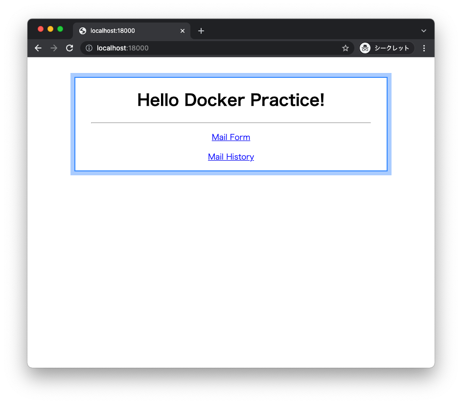
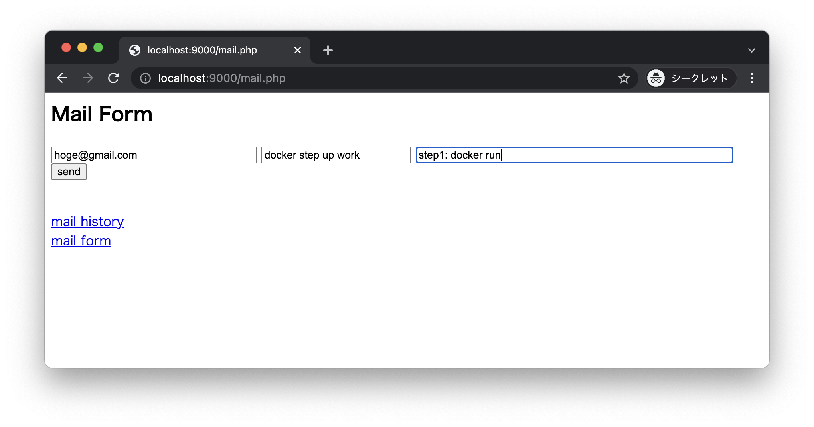
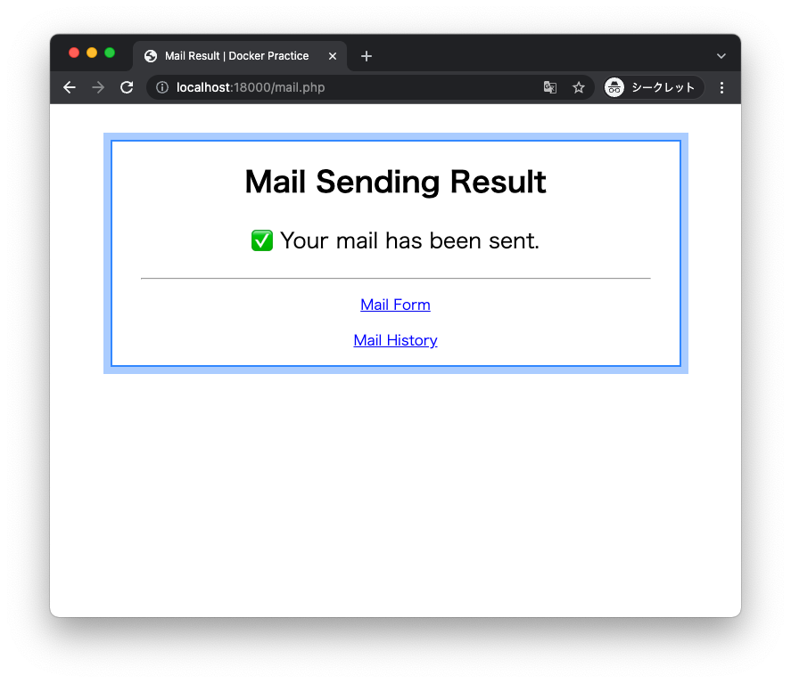
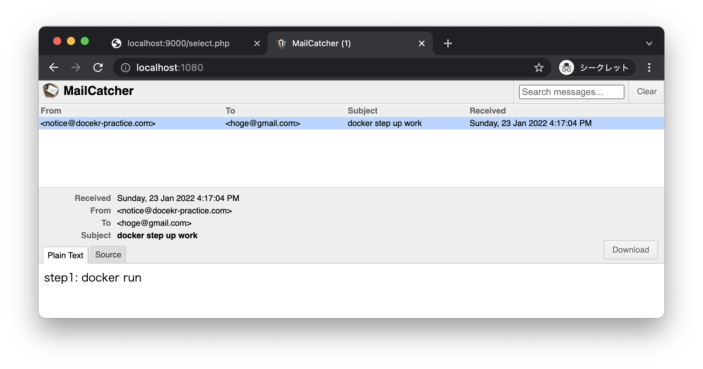
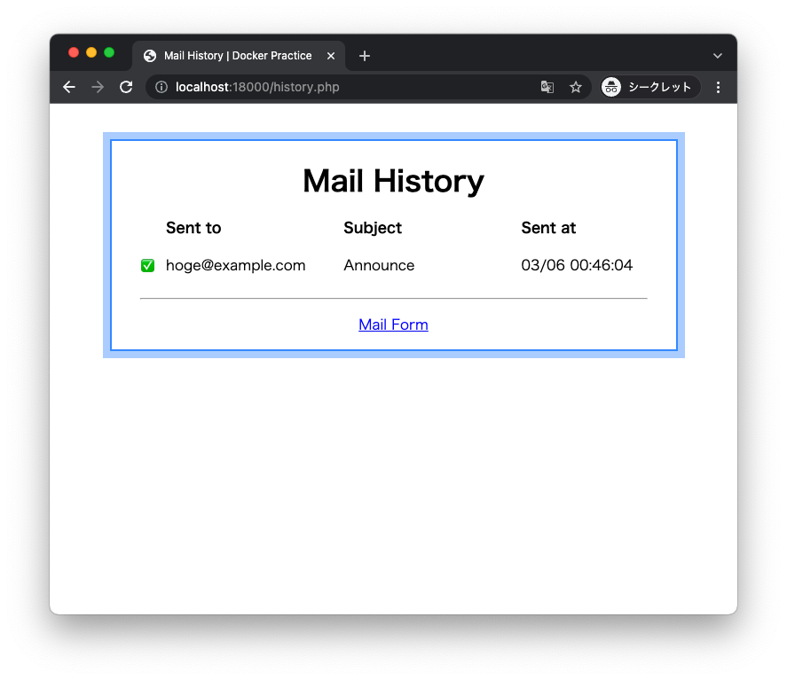

# Docker Practice
## お断り全般
- M1 考慮済み
- `$` がホスト ( Windows や Mac )
- `#` がコンテナ
- コピペはせずコマンドは手打ちしよう
- この Book はローカル開発にフォーカスした内容
  - Docker がローカル開発のためのものという意味ではない
- `jq`

### Book の閲覧
最終的に Zenn に公開するつもりですが、Zenn は限定公開ができないため GitHub で共有します

ただ GitHub は Markdown の文法差異やプレビューの面倒さのせいで書きづらいので、Zenn 形式で書かせてもらいます

Zenn のプレビュー機能で閲覧してください

#### Node.js がローカルにある人
```
$ git clone https://github.com/suzuki-hoge/docker-stepup-work
$ cd zenn
$ npm install
$ npx zenn preview
```

http://localhost:8000

#### Docker がローカルにある人
これから Docker を学ぶのに Docker コマンドで閲覧するというのも...

```
$ git clone https://github.com/suzuki-hoge/docker-stepup-work
$ cd zenn
$ docker compose up -d --build
```

http://localhost:18000

#### Docker + Make がローカルにある人
ワークを最後までと Docker Desktop + Make を使うので、今インストールしても良いでしょう

Mac は Make は標準インストールです ( Windows はわかりません )

```
$ git clone https://github.com/suzuki-hoge/docker-stepup-work
$ cd zenn
$ make up
```

http://localhost:18000

## 目的
- todo 知識の分類 Dockerfile / Linux / PHP
- 自分で問題に対応できるような基礎知識を得る
- 渡された構成を起動するだけではなく、自分で構成を作る過程を経験する
- そのために Docker Compose と Docker を自由に読み書き換えられるようになる

## ほげめも
- todo 知識の分類 Dockerfile / Linux / PHP を分けてポイントする
- todo ターミナルとシェルについてちゃんとする
- todo tree の書式を統一する
- todo 絵とコマンドオプションとまとめを統一する
- todo MailCatcher / MSMTP / MTA について整理する
- todo 使うオプションは全て解説します
- todo 練習: 
- todo 説明アイコン / ワークアイコン
- todo サーバ / データベース

### 構成 ( 仮 )
- 📚 Step0: 🐧 仮想化って？
- 📚 Step0: 🐳 Docker って？
- 📚 Step0: 🐳 このワークでなにするの？
- 📚 Step1: 🐳 コンテナって？
- 🖥️ Step1: 🐳 Ubuntu コンテナで PHP が動くようにしよう
- 🖥️ Step1: 🐳 MySQL データベースを数分で用意しよう
- 🖥️ Step1: 🐳 Mail サーバを数分で用意しよう
- 📚 Step1: 🐳 コンテナ一覧ってどうやって確認するの？
- 📚 Step1: 🐳 コンテナってどうやって終了するの？
- 📚 Step1: 🐳 コンテナを終了するとどうなるの？
- 📚 Step1: 📝 まとめ
- 📚 Step2: 🐳 イメージって？
- 🖥️ Step2: 🐳 PHP イメージを作ってコンテナ起動を早くしよう
- 🖥️ Step2: 🐧 PHP コンテナの MTA の設定をしよう
- 🖥️ Step2: 🐳 MySQL サーバの設定をしよう
- 📚 Step2: 🐧 パッケージ管理コマンドって？
- 📚 Step2: 🐧 OS やパッケージ管理コマンドをすぐ把握するには？
- 📚 Step2: 📝 まとめ
- 📚 Step3: 🐳 ポートって？
- 🖥️ Step3: 🐳 PHP コンテナにブラウザアクセスできるようにしよう
- 🖥️ Step3: 🐳 Mail コンテナにブラウザアクセスできるようにしよう
- 📚 Step3: 📝 まとめ
- 📚 Step4: 🐳 エラーって？
- 🖥️ Step4: 🐳 ビルドのエラーを調べられるようになろう
- 🖥️ Step4: 🐳 コンテナ起動のエラーを調べられるようになろう
- 🖥️ Step4: 🐧 コンテナプロセスのエラーを調べられるようになろう
- 📚 Step4: 📝 まとめ
- 📚 Step5: 🐳 ボリュームって？
- 🖥️ Step5: 🐳 PHP コンテナのファイルをホストマシンのエディタで編集できるようにしよう
- 🖥️ Step5: 🐳 MySQL コンテナのデータが残るようにしよう
- 🖥️ Step5: 🐳 MySQL コンテナの起動時にテーブルを作成しよう
- 📚 Step5: 📝 まとめ
- 📚 Step6: 🐳 ネットワークって？
- 🖥️ Step6: 🐳 PHP コンテナから MySQL データベースを使おう
- 🖥️ Step6: 🐳 PHP コンテナからメールを送信してみよう
- 📚 Step6: 📝 まとめ
- 📚 Step7: 🐧 Makefile って？
- 🖥️ Step7: 🐧 長いコマンドを超楽に入力できるようにしよう
- 📚 Step7: 📝 まとめ
- 📚 Step8: 🐳 Docker Compose って？
- 🖥️ Step8: 🐳 todo replace
- 📚 Step8: 📝 まとめ
- 📚 おまけ: ホストマシンの言語インストールに応用するには
- 📚 おまけ: エディタ設定に応用するには
- 📚 おまけ: 自動テストに応用するには
- 📚 おまけ: デプロイに応用するには

## 完成品
複数の Dockerfile からなるコンテナを docker-compose.yaml で起動し、PHP を動かします

```
$ tree .
.
|-- Makefile
|-- README.md
|-- docker
|   |-- db
|   |   |-- Dockerfile
|   |   |-- init.sql
|   |   `-- my.cnf
|   `-- php
|       |-- Dockerfile
|       |-- mail.ini
|       `-- mailrc
|-- docker-compose.yaml
`-- src
    |-- index.php
    |-- mail.php
    `-- select.php
```

開発中に行う主要なコマンドは Makefile を配置して実行しやすいようにします

次の手順で起動できるはずです

```
$ git clone https://github.com/suzuki-hoge/docker-stepup-work

$ cd docker-stepup-work

$ make build

$ make up

$ make ps

NAME                    SERVICE    STATUS     PORTS
docker-practice-db      db         running    3306/tcp, 33060/tcp
docker-practice-php     php        running    0.0.0.0:9000->8000/tcp, :::9000->8000/tcp
docker-practice_mail    mail       running    1025/tcp, 0.0.0.0:1080->1080/tcp, :::1080->1080/tcp
```

ブラウザを開くと簡単なトップページが表示され



メール送信フォームに入力すると



メールが送信されます ( メーラーはモックなので実際には送信されません / 実在しない宛先でも動きます )



モックのメールサーバでメールの内容を確認したり



メールの送信履歴を確認することができます



## 前提
次のインストールが必要です

- make ( macOS の場合は不要です )
- Docker Desktop ( 次ページで説明と URL 記載を行います )

この本は Windows の GitBash と macOS ( Intel / M1 ) で動作することを確認しています

